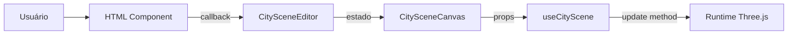

# HTML Components

Componentes React DOM do painel lateral do PixCity.

> [!info] O que é "HTML" aqui
> Componentes que renderizam tags como `div`, `section`, `input`, `select` e `label`. Não são arquivos HTML estáticos — são componentes React puros de interface.

## Objetivo da Camada

A pasta `src/components/html` organiza todo o painel lateral sem misturar interface com lógica Three.js.

Esses componentes:
- mostram controles para o usuário
- recebem dados via `props`
- chamam callbacks quando o usuário altera valores
- **não** criam objetos Three.js
- **não** conhecem `scene`, `camera` ou `renderer`

## Componentes Principais

### `BuildingHeightInput.tsx`

Overlay fixo no centro superior da página — é o input de doação.

**Responsabilidades:**
- Exibir input numérico para o valor da doação
- Ao clicar em "Doar" (ou pressionar Enter), chamar `onSubmit(value)`
- Suporte a `onBulkSubmit(values[])` para envio de múltiplas doações em lote
- Exibir inputs de layout de quadra: `bloco` (blockSize) e `rua` (streetWidth)
- Limpar o campo após cada envio bem-sucedido
- Não conhece Three.js nem estado global

**Props:**
| Prop | Tipo | Descrição |
|---|---|---|
| `onSubmit` | `(value: number) => void` | Doação individual |
| `onBulkSubmit` | `(values: number[]) => void` | Lote de doações |
| `blockLayoutSettings` | `BlockLayoutSettings` | Tamanho de quadra e largura de rua |
| `onBlockLayoutChange` | `(s: BlockLayoutSettings) => void` | Atualiza layout em tempo real |

> [!note] Fluxo de doação
> Cada envio chama `canvasRef.addDonation(value)` em `CitySceneEditor`. O prédio de maior valor sempre ocupa o centro da quadra central.

---

### `CityControlPanel.tsx`

Componente que monta o painel completo.

**Responsabilidades:**
- Receber todos os estados do editor
- Organizar as seções em abas
- Repassar callbacks para cada seção

**Abas:**

| Aba | Seções |
|---|---|
| **Geral** | Intro, prédios, sombras, direção de renderização, chão |
| **Texturas** | Configurações PBR das fachadas |
| **Luz** | Ambient, hemisphere, directional |
| **Ambiente** | Configurações de HDRI e skybox |

---

### `PanelIntro.tsx`

Cabeçalho do painel com métricas em tempo real:

- Título do projeto
- Quantidade de prédios ativos
- Chunks carregados
- Prédios gerando sombra
- Intensidade solar atual

---

### `BuildingControls.tsx`

Configurações visuais dos prédios:

- Cor
- Roughness
- Metalness

> [!tip] Ponto de entrada
> Se quiser alterar a interface de personalização dos prédios, comece aqui.

---

### `TextureControls.tsx`

Configurações de textura PBR das fachadas:

| Controle | Descrição |
|---|---|
| `enabled` | Ativa/desativa texturas |
| `clayRender` | Espelhamento nas superfícies (roughness baixo + metalness alto) |
| `normalScale` | Intensidade do mapa de normais |
| `displacementScale` | Relevo visual via displacement map (0–5) |
| `tilingScale` | Repetição da textura (UV repeat) |
| `roughnessIntensity` | Multiplicador do mapa de roughness (0–2) |
| `metalnessIntensity` | Multiplicador do mapa de metalness (0–3, padrão 2) |
| `emissiveIntensity` | Brilho/glow nas fachadas usando o colorMap como emissiveMap |

Texturas carregadas de: `src/assets/texture/Facade006_1K-mirrored-PNG/`
Mapas disponíveis: color, normal, roughness, metalness, displacement.

---

### `ShadowControls.tsx`

Configurações de sombra:

- Ligar/desligar sombras
- Quantidade de prédios que geram sombra
- Parâmetros da câmera de sombra

---

### `RenderDirectionControls.tsx`

Distâncias de renderização por direção da câmera:

- Frente
- Laterais
- Trás

> [!note]
> Esse componente não calcula nada. Apenas altera estado que o [[scene-managers|ChunkManager]] consome (mantido para referência arquitetural).

---

### `GroundControls.tsx`

Configurações do chão:

- Cor
- Tipo de material (`standard`, `matte`, `soft-metal`, `polished`)

---

### `SceneLightControls.tsx`

Luzes gerais da cena:

- Ambient light
- Directional light (posição por ângulos esféricos, alvo)
- Métricas derivadas como intensidade solar

---

### `EnvironmentControls.tsx`

Configurações do ambiente HDRI:

- `offsetX` — rotação horizontal do skybox
- `offsetY` — deslocamento vertical do horizonte (UV offset)
- `offsetZ` — roll (inclinação diagonal)

---

## Componentes Reutilizáveis (`controls/`)

Componentes pequenos e reaproveitáveis de formulário.

### `PanelSection.tsx`

Bloco visual padrão de cada seção. Use ao criar novas seções para manter o visual consistente.

### `ColorField.tsx`

Campo de cor com `input type="color"` + `input type="text"`. Bom quando o usuário quer seletor visual ou digitar hex manualmente.

### `RangeField.tsx`

Slider numérico. Use quando o valor fizer sentido arrastar.

### `NumberField.tsx`

Input numérico direto. Use quando o valor precisa ser digitado.

### `CheckboxField.tsx`

Campo booleano simples.

### `PointLightCard.tsx`

Card para configuração de point lights individuais.

## Fluxo de Comunicação

1. Usuário mexe em um input
2. Componente HTML chama callback
3. `CitySceneEditor` atualiza estado React
4. `CitySceneCanvas` recebe novo estado
5. [[scene-hooks|useCityScene]] sincroniza com o runtime Three.js

## Regra Prática

- Problema **visual ou de formulário** → procure em `src/components/html`
- Cena **não reagiu ao novo valor** → veja [[scene-hooks|useCityScene.ts]] ou [[scene-runtime|createCitySceneRuntime.ts]]
