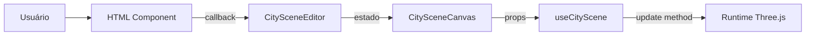

# HTML Components

Componentes React DOM do painel lateral do PixCity.

> [!info] O que é "HTML" aqui
> Componentes que renderizam tags como `div`, `section`, `input`, `select` e `label`. Não são arquivos HTML estáticos — são componentes React puros de interface.

## Objetivo da Camada

A pasta `src/components/html` organiza todo o painel lateral sem misturar interface com lógica Three.js.

Esses componentes:
- mostram controles para o usuário
- recebem dados via `props`
- chamam callbacks quando o usuário altera valores
- **não** criam objetos Three.js
- **não** conhecem `scene`, `camera` ou `renderer`

## Componentes Principais

### `BuildingHeightInput.tsx`

Overlay fixo no centro superior da página — é o input de doação.

**Responsabilidades:**
- Exibir input numérico para o valor da doação
- Ao clicar em "Doar" (ou pressionar Enter), chamar `onSubmit(value)`
- Suporte a `onBulkSubmit(values[])` para envio de múltiplas doações em lote
- Exibir inputs de layout de quadra: `bloco` (blockSize) e `rua` (streetWidth)
- Limpar o campo após cada envio bem-sucedido
- Não conhece Three.js nem estado global

**Props:**
| Prop | Tipo | Descrição |
|---|---|---|
| `onSubmit` | `(value: number) => void` | Doação individual |
| `onBulkSubmit` | `(values: number[]) => void` | Lote de doações |
| `blockLayoutSettings` | `BlockLayoutSettings` | Tamanho de quadra e largura de rua |
| `onBlockLayoutChange` | `(s: BlockLayoutSettings) => void` | Atualiza layout em tempo real |

> [!note] Fluxo de doação
> Cada envio chama `canvasRef.addDonation(value)` em `CitySceneEditor`. O prédio de maior valor sempre ocupa o centro da quadra central.

---

### `BuildingCustomizePanel.tsx`

Painel de personalização de um edifício individual, exibido ao clicar em um prédio na cena. Posicionado no canto superior direito com scroll interno para caber em telas menores.

**Responsabilidades:**
- Exibir campos de personalização para o edifício selecionado
- Atualizar cor, formato, letreiro, acessório de topo e LED de arestas em tempo real
- Botão de fechar (X) para desselecionar o edifício

**Props:**

| Prop | Tipo | Descrição |
|---|---|---|
| `donationId` | `number` | ID da doação selecionada |
| `initialColor` | `string` | Cor atual do edifício (customizada ou global) |
| `initialBuildingShape` | `BuildingShape` | Formato atual (`"default"`, `"twisted"`, `"octagonal"`, `"setback"`, `"tapered"`, `"chrysler"`, `"hearst"`, `"empire"` ou `"taipei"`) |
| `initialTilingScale` | `number` | Multiplicador de tiling da textura (1.0 = sem alteração) |
| `initialRooftopType` | `RooftopType` | Estado atual do acessório de topo |
| `initialSignText` | `string` | Texto atual do letreiro na fachada |
| `initialSignSides` | `number` | Quantidade de lados com letreiro (1–4) |
| `initialEdgeLightType` | `EdgeLightType` | Estado atual do LED nas arestas (`"none"` ou `"led"`) |
| `onColorChange` | `(id: number, color: string) => void` | Callback de troca de cor |
| `onBuildingShapeChange` | `(id: number, shape: BuildingShape) => void` | Callback de troca de formato |
| `onTilingScaleChange` | `(id: number, tilingScale: number) => void` | Callback de troca de tiling |
| `onRooftopChange` | `(id: number, type: RooftopType) => void` | Callback de troca do acessório de topo |
| `onSignTextChange` | `(id: number, text: string) => void` | Callback de troca de texto do letreiro |
| `onSignSidesChange` | `(id: number, sides: number) => void` | Callback de troca de lados do letreiro |
| `onEdgeLightTypeChange` | `(id: number, type: EdgeLightType) => void` | Callback de toggle do LED |
| `onClose` | `() => void` | Fecha o painel e limpa o foco |

**Seções do painel:**

| Seção | Controles | Descrição |
|---|---|---|
| **Aparência** | `ColorField` | Cor individual do edifício (hex) |
| **Formato** | Botões | Opções: padrão (caixa), torre torcida, torre octogonal, torre setback, torre afunilada, Chrysler, Hearst Tower, Empire State ou Taipei 101 |
| **Texturas** | `RangeField` | Tiling Scale (0.25× – 4×) — ajusta a repetição da textura **só nesse edifício**. Valores ≠ 1.0 fazem o prédio sair do `InstancedMesh` |
| **Letreiro** | Input de texto + seletor de lados | Marca/empresa na fachada (máx 30 chars). Seletor de lados (1–4) aparece quando há texto |
| **Topo** | Botões | Opções: nenhum, holofotes ou heliponto |
| **LED de arestas** | Botões | Liga/desliga o LED nas arestas verticais e topo |

> [!note] Fluxo de personalização
> Clique no edifício → `onBuildingClick(donationId)` → `CitySceneEditor` chama `focusOnDonation` (destaque visual) e abre `BuildingCustomizePanel` → cada mudança chama `updateCustomization` que monta o `BuildingCustomization` completo e envia ao runtime via `canvasRef.updateDonationCustomization(id, {...})`.

> [!tip] Onde cada personalização é aplicada
> - **Cor** → `InstancedBufferAttribute` (instanceColor) quando o prédio fica no `InstancedMesh`; clone de material quando o prédio vira mesh próprio
> - **Formato** → `Mesh` próprio via builders dedicados em [[scene-builders]] (pula alocação no `InstancedMesh`)
> - **Texturas (Tiling)** → uniform `uTilingMultiplier` por material clonado; valores ≠ 1.0 movem o prédio para `customShapeMeshes` (ver [[scene-managers#Customizações que exigem Mesh próprio (`needsCustomMesh`)|needsCustomMesh]])
> - **Letreiro** → `CanvasTexture` + `PlaneGeometry` via [[scene-builders#createSignMesh.ts|createSignMesh]]
> - **Topo** → `THREE.Group` via [[scene-builders#createRooftopMesh.ts|createRooftopMesh]]
> - **LED de arestas** → `THREE.Group` (core emissivo + halo aditivo) via [[scene-builders#createEdgeLightMesh.ts|createEdgeLightMesh]]

> [!warning] Limitação: acessórios em formatos customizados
> Letreiros e LEDs possuem tratamento específico para formatos customizados, mas holofotes/heliponto ainda usam a **caixa lógica** (`width/depth/height` da bounding box). Em formatos com topo não retangular, acessórios de topo podem ocupar a área da bounding box, não exatamente a silhueta da cobertura.

---

### `CityControlPanel.tsx`

Componente que monta o painel completo de configuração da cena. **Escondido por padrão** — aberto via botão de engrenagem no canto inferior direito.

**Responsabilidades:**
- Receber todos os estados do editor
- Organizar as seções em abas
- Repassar callbacks para cada seção

**Abas:**

| Aba | Seções |
|---|---|
| **Geral** | Intro, prédios, sombras, direção de renderização, chão |
| **Texturas** | Configurações PBR das fachadas |
| **Luz** | Ambient, hemisphere, directional |
| **Ambiente** | Configurações de HDRI e skybox |

---

### `PanelIntro.tsx`

Cabeçalho do painel com métricas em tempo real:

- Título do projeto
- Quantidade de prédios ativos
- Chunks carregados
- Prédios gerando sombra
- Intensidade solar atual

---

### `BuildingControls.tsx`

Configurações visuais dos prédios:

- Cor
- Roughness
- Metalness

> [!tip] Ponto de entrada
> Se quiser alterar a interface de personalização dos prédios, comece aqui.

---

### `TextureControls.tsx`

Configurações de textura PBR das fachadas:

| Controle | Descrição |
|---|---|
| `enabled` | Ativa/desativa texturas |
| `clayRender` | Espelhamento nas superfícies (roughness baixo + metalness alto) |
| `normalScale` | Intensidade do mapa de normais |
| `displacementScale` | Relevo visual via displacement map (0–5) |
| `tilingScale` | Repetição da textura (UV repeat) |
| `roughnessIntensity` | Multiplicador do mapa de roughness (0–2) |
| `metalnessIntensity` | Multiplicador do mapa de metalness (0–3, padrão 2) |
| `emissiveIntensity` | Brilho/glow nas fachadas usando o colorMap como emissiveMap |

Texturas carregadas de: `src/assets/texture/Facade006_1K-mirrored-PNG/`
Mapas disponíveis: color, normal, roughness, metalness, displacement.

---

### `ShadowControls.tsx`

Configurações de sombra:

- Ligar/desligar sombras
- Quantidade de prédios que geram sombra
- Parâmetros da câmera de sombra

---

### `RenderDirectionControls.tsx`

Distâncias de renderização por direção da câmera:

- Frente
- Laterais
- Trás

> [!note]
> Esse componente não calcula nada. Apenas altera estado que o [[scene-managers|ChunkManager]] consome (mantido para referência arquitetural).

---

### `GroundControls.tsx`

Configurações do chão:

- Cor
- Tipo de material (`standard`, `matte`, `soft-metal`, `polished`)

---

### `SceneLightControls.tsx`

Luzes gerais da cena:

- Ambient light
- Directional light (posição por ângulos esféricos, alvo)
- Métricas derivadas como intensidade solar

---

### `EnvironmentControls.tsx`

Configurações do ambiente HDRI:

- `offsetX` — rotação horizontal do skybox
- `offsetY` — deslocamento vertical do horizonte (UV offset)
- `offsetZ` — roll (inclinação diagonal)

---

### `HorizonControls.tsx`

Controles da aba **Horizonte**. Dividido em duas seções:

**Silhueta do Horizonte:**
- `color` — cor dos prédios da silhueta
- `distance` — distância da câmera até a fileira (100–600)

**Névoa:**
- `fogDensity` — densidade da névoa exponencial (`FogExp2`). Controla quão rápido os objetos distantes somem (0–0.05, padrão 0.01)
- `fogColor` — cor da névoa. Deve combinar com o céu para o efeito de fusão

> [!note]
> A névoa é global — afeta toda a cena, não só o horizonte. Aumentar `fogDensity` também dissolve os prédios da cidade em distâncias maiores.

---

## Componentes Reutilizáveis (`controls/`)

Componentes pequenos e reaproveitáveis de formulário.

### `PanelSection.tsx`

Bloco visual padrão de cada seção. Use ao criar novas seções para manter o visual consistente.

### `ColorField.tsx`

Campo de cor com `input type="color"` + `input type="text"`. Bom quando o usuário quer seletor visual ou digitar hex manualmente.

### `RangeField.tsx`

Slider numérico. Use quando o valor fizer sentido arrastar.

### `NumberField.tsx`

Input numérico direto. Use quando o valor precisa ser digitado.

### `CheckboxField.tsx`

Campo booleano simples.

### `PointLightCard.tsx`

Card para configuração de point lights individuais.

## Fluxo de Comunicação

1. Usuário mexe em um input
2. Componente HTML chama callback
3. `CitySceneEditor` atualiza estado React
4. `CitySceneCanvas` recebe novo estado
5. [[scene-hooks|useCityScene]] sincroniza com o runtime Three.js

## Regra Prática

- Problema **visual ou de formulário** → procure em `src/components/html`
- Cena **não reagiu ao novo valor** → veja [[scene-hooks|useCityScene.ts]] ou [[scene-runtime|createCitySceneRuntime.ts]]
