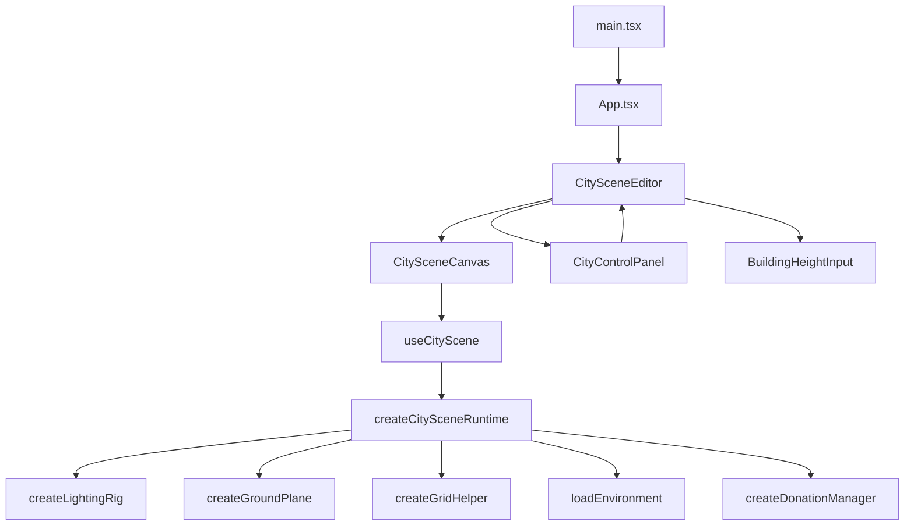

# PixCity — Documentação

PixCity é uma cena 3D de cidade procedural feita com `React 19`, `Three.js`, `TypeScript` e `Vite`. Gera prédios baseados em doações, com texturas PBR, iluminação configurável e sistema de sombras — tudo controlável via painel em tempo real.

> [!abstract] Para quem é essa documentação?
> O objetivo é ajudar um dev júnior a entender por onde a aplicação começa, onde cada responsabilidade fica, em qual arquivo mexer e como os dados saem do React e chegam na cena 3D.

## Visão Geral Rápida

O projeto é dividido em 3 grandes partes:

| Pasta | Responsabilidade |
|---|---|
| `src/components` | Interface React — editor, painel lateral e canvas |
| `src/scene` | Lógica 3D — tipos, configs, utils, builders, managers, hooks e runtime |
| `doc-pixcity` | Documentação da estrutura |

## Estrutura de Arquivos

```text
src/
  App.tsx
  main.tsx
  index.css
  components/
    CitySceneEditor.tsx
    html/
      CityControlPanel.tsx
      BuildingHeightInput.tsx
      BuildingControls.tsx
      TextureControls.tsx
      GroundControls.tsx
      SceneLightControls.tsx
      ShadowControls.tsx
      RenderDirectionControls.tsx
      EnvironmentControls.tsx
      PointLightControls.tsx
      PanelIntro.tsx
      controls/
        PanelSection.tsx
        ColorField.tsx
        RangeField.tsx
        NumberField.tsx
        CheckboxField.tsx
        PointLightCard.tsx
    three/
      CitySceneCanvas.tsx
  scene/
    types.ts
    config/
      citySceneConfig.ts
      buildingConfig.ts
      textureConfig.ts
      groundConfig.ts
      lightConfig.ts
      shadowConfig.ts
      renderDirectionConfig.ts
      environmentConfig.ts
      blockLayoutConfig.ts
    builders/
      createLightingRig.ts
      createGroundPlane.ts
      createGridHelper.ts
      createHorizonSilhouette.ts
      loadEnvironment.ts
    managers/
      createDonationManager.ts
      createChunkManager.ts   ← referência arquitetural
      createShadowManager.ts  ← referência arquitetural
    hooks/
      useCityScene.ts
    runtime/
      createCitySceneRuntime.ts
    utils/
      math.ts
      materials.ts
      lighting.ts
      random.ts
      devAssertions.ts
doc-pixcity/
  index.md
  html-components.md
  three-components.md
  scene-config.md
  scene-types.md
  scene-utils.md
  scene-builders.md
  scene-managers.md
  scene-runtime.md
  scene-hooks.md
```

## Fluxo da Aplicação

### 1. Entrada

- `src/main.tsx` → renderiza React no `#root`
- `src/App.tsx` → renderiza `CitySceneEditor`

### 2. Container Principal

`src/components/CitySceneEditor.tsx` é o componente mais importante do lado React.

Ele guarda todos os estados:

- `buildingSettings`
- `textureSettings`
- `groundSettings`
- `lightSettings`
- `shadowSettings`
- `renderDirectionSettings`
- `environmentSettings`
- `sceneStats`

E entrega para:
- [[three-components|CitySceneCanvas]] — monta a cena 3D
- [[html-components|CityControlPanel]] — mostra os controles

Também gerencia a ação de doação via `canvasRef.addDonation(value)`, exposta pelo handle imperativo de `CitySceneCanvas`.

### 3. Canvas 3D

[[three-components|CitySceneCanvas.tsx]] cria um `div` com `ref` e chama o hook [[scene-hooks|useCityScene]], que monta o renderer Three.js dentro do div.

### 4. Painel Lateral

[[html-components|CityControlPanel.tsx]] organiza os componentes do painel em abas. Não conhece Three.js — só atualiza estado React.

### 5. Hook da Cena

[[scene-hooks|useCityScene.ts]] conecta React com Three.js. Cria o runtime uma vez, depois sincroniza mudanças de estado chamando métodos do runtime.

### 6. Runtime da Cena

[[scene-runtime|createCitySceneRuntime.ts]] é o cérebro do Three.js. Orquestra scene, camera, renderer, controls, builders e managers.

## Diagrama de Fluxo



## Onde Mexer?

| Objetivo | Arquivo |
|---|---|
| Alterar valor padrão dos prédios | [[scene-config]] |
| Alterar a UI do painel | [[html-components]] |
| Alterar o canvas ou a ligação com o hook | [[three-components]] |
| Alterar fórmulas de luz, clamp ou material | [[scene-utils]] |
| Alterar criação do chão, grid, luzes ou ambiente | [[scene-builders]] |
| Alterar geração dos prédios de doação | [[scene-managers]] |
| Alterar o ciclo completo da cena | [[scene-runtime]] |
| Entender o contrato dos dados | [[scene-types]] |
| Entender como React sincroniza com Three.js | [[scene-hooks]] |

## Ordem de Leitura Recomendada

1. `src/App.tsx`
2. `src/components/CitySceneEditor.tsx`
3. [[html-components]]
4. [[three-components]]
5. [[scene-hooks]]
6. [[scene-runtime]]
7. [[scene-managers]]
8. [[scene-builders]]
9. [[scene-config]]
10. [[scene-utils]]

## Ideia Central da Arquitetura

```
React  → estado e interface
Three.js → renderização 3D
config   → valores padrão
types    → contratos
utils    → funções puras
builders → peças isoladas da cena
managers → partes complexas com estado interno
runtime  → orquestra tudo
hooks    → ponte React ↔ runtime
```

> [!tip] Padrões do projeto
> - **Factory functions** em vez de classes (`create*()`)
> - **Dispose explícito** — todo recurso Three.js tem cleanup
> - **InstancedMesh** para performance nos prédios
> - **Seeded random** para geração determinística por posição
